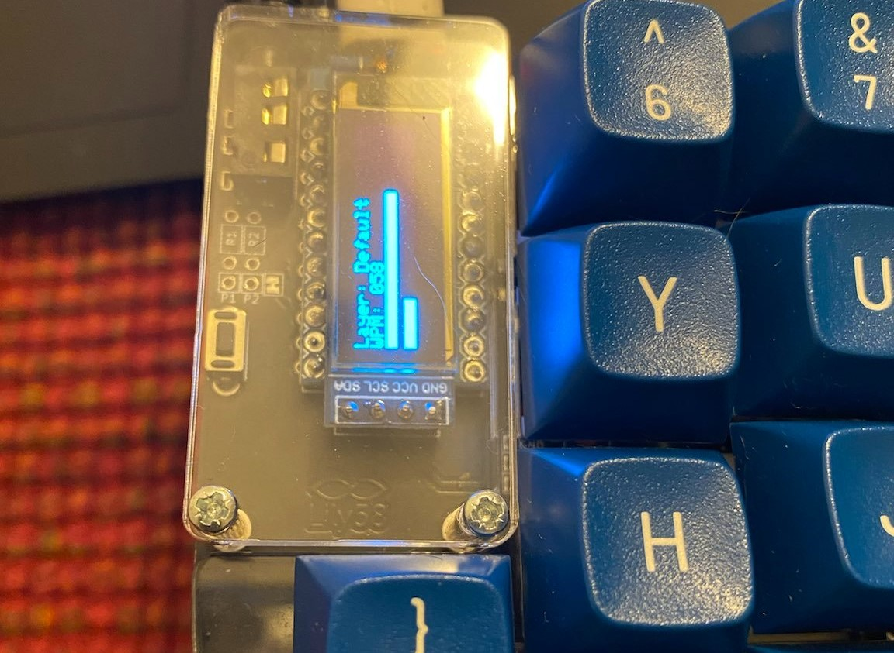

This keymap is based on my [qmk balance branch](https://github.com/rompgadgets/qmk_firmware/tree/balance) which includes a modification to the split_kb [matrix](https://github.com/rompgadgets/qmk_firmware/blob/880cb62760988a24b8f81fc85ec6f4d1f5eee5df/quantum/split_common/matrix.c#L48) to add a user function that lets you track keystrokes between the right and left hand sides of the keyboard.  

The keystrokes are rendered as bar graphs on the OLED screen along with WPM and the current active layer.

